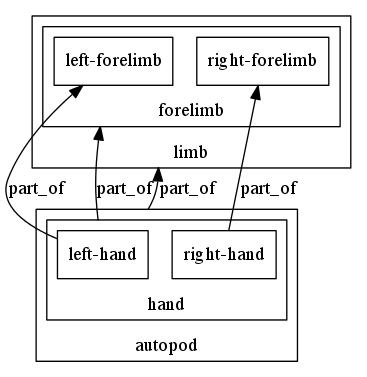

# Translate OBO Graphs into Dot for viewing in GraphViz

Quickstart:

```
./bin/og2dot.js tests/simple-og.json > test.dot
dot test.dot -Tpng -Grankdir=BT > test.png
```

To convert an ontology to an OBO Graph JSON file see:

https://github.com/geneontology/obographs

Alternatively any bbop-json produced by AmiGO/SciGraph can be used

## Why Dot/GraphViz?

Why dot D3, cytoscape js etc?

These are all very nice and pretty, but GraphViz has some powerful
features that I have not found in any other framework (or have been
too lazy to find out how to do). In particular:

 * Easy to run on command line
 * The ability to _nest_ relationships (update: compound graphs in cytoscape.js)
 * simple control over box and edge visual attributes
 * embedding arbitrary HTML

This is intended to replace blipkit graphviz generation. For some
examples, see [mondo report](https://github.com/monarch-initiative/monarch-disease-ontology/blob/master/reports/genes/ABCC9.md)

## Nesting

Specify one or more containment predicates using `-c`

```
./bin/og2dot.js -c is_a tests/simple-og.json > test.dot
```

Generates:



Note only works for subgraphs that exhibit disjointness over this property, acyclicity

## Stylesheets

Can be passed using `-s`

```
./bin/og2dot.js -c is_a tests/simple-og.json > test.dot
```

### Rendering aboxes with anonymous nodes

E.g. LEGO models

```
{
 nodeFilter : {
                "type" : "INDIVIDUAL"
              },
              labelFrom : "type"
}
```
