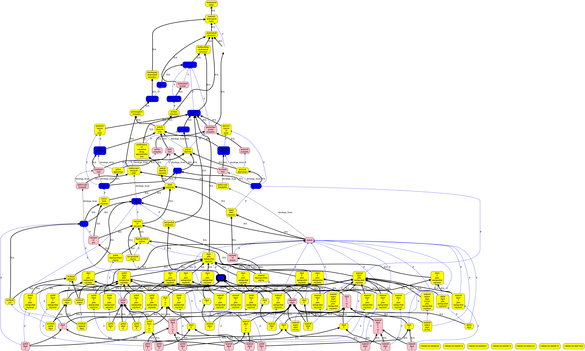
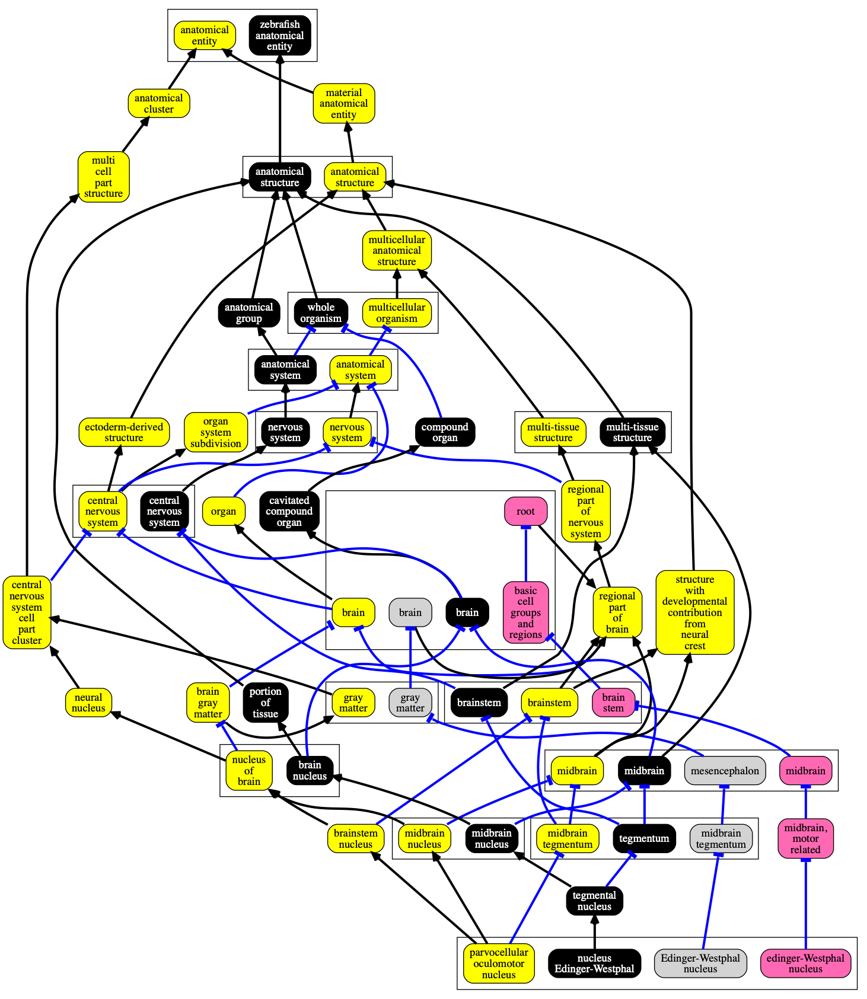
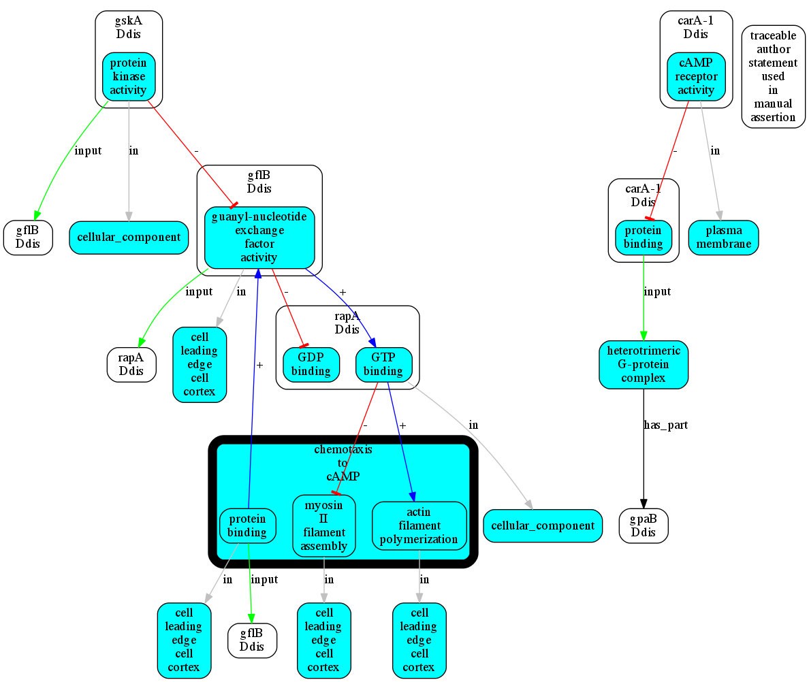

[](http://badge.fury.io/js/obographviz)

# Translate OBO Graphs into Dot/Graphviz

 * Input: a [OBO Graph JSON](https://github.com/geneontology/obographs) object
 * Optional: a JSON ontology stylesheet
 * Output: a Dot-format / Graphviz file

## Requirements

* Node.js ≥ 14.16

## Installation

The `obographviz` package can be installed via NPM either locally or globally. If you're not familiar with NPM, see the following to get started:

* [Downloading and installing Node.js and npm](https://docs.npmjs.com/downloading-and-installing-node-js-and-npm)
* [Getting packages from the registry](https://docs.npmjs.com/packages-and-modules/getting-packages-from-the-registry)

If you intend to primarily use the command line tool provided by this package or you're using a tool like [Ontology Access Kit](https://github.com/INCATools/ontology-access-kit) which depends on it, install globally:

```bash
npm install -g obographviz
```

Once installed globally, the `og2dot` executable will automatically be added to your `PATH`.

Otherwise, if you want to use the package in an existing Node.js project install it locally:

```bash
npm install obographviz
```

## Quickstart

### Command line

**All examples in this README assume `obographviz` has been installed globally. If it was installed locally to a project, call `og2dot` via [`npx`](https://www.npmjs.com/package/npx) or an [npm script](https://docs.npmjs.com/cli/v8/using-npm/scripts).**

See the `examples` directory in this repositories for sample OBO Graph JSON files and stylesheets.

```bash
og2dot simple-og.json > test.dot
dot test.dot -Tpng -Grankdir=BT > test.png
```

### API

```javascript
import { OboGraphViz } from "obographviz";

const obograph = { ... }

const compoundRelations = ['BFO:0000050']
const styleMap = {}
const gv = new OboGraphViz(obograph)
const dot = gv.renderDot(compoundRelations, styleMap)
console.log(dot)
```


# Features

## Nesting

One or more predicates can be designated as 'compound', i.e. used for nesting.

On the command line, use `-c`. In the API, use `compoundRelations`

Example:

```bash
og2dot -c is_a simple-og.json > test.dot
```

Generates:


Note only works for subgraphs that exhibit disjointness over this property, acyclicity

Use the `-I` option for inverting the containment relation (e.g. to use `has part` rather than `part of`).


## Stylesheets

In the API can be passed using `styleMap`. On the command line, by using either `-s` (to pass a JSON file) or `-S` (to pass stringified JSON object directly on command line)

E.g.

```bash
og2dot -s example-style.json -c is_a simple-og.json > test.dot
```

### Stylesheet Standard

This is now documented separately:

[kgviz-model](https://berkeleybop.github.io/kgviz-model/)


### Global stylemap properties

These go in the root of the stylemap object

```json
{
    "style": "filled",
    "fillcolor": "green"
}
```

this sets all nodes to be filled green

### Edge properties by relationship type

Each relationship type can have its own individual style, by passing relationProperties. This is keyed by the CURIE for the relation (or "is_a" for subClassOf):

```json
{
    "relationProperties": {
        "is_a": {
            "color": "black",
            "penwith": 3,
            "arrowhead": "open",
            "label": ""
        },
        "BFO:0000050": {
            "arrowhead": "tee",
            "color": "blue"
        }
    }
}
```

### Node properties by prefix

Pass in prefixProperties to be able to assign individual properties for ontology prefixes. This can be useful when visualization graphs that combine multiple ontologies

```json
{
    "prefixProperties": {
        "SO": {
            "fillcolor": "yellow"
        },
        "RO": {
            "fillcolor": "pink"
        },
        "BFO": {
            "fillcolor": "cyan"
        }
    }
}
```

### Conditional properties

Arbitrary conditions can be set using `conditionalProperties` for example:

```json
{
    "conditionalProperties": [
        {
            "conditions": {
                "subset":"efo_slim"
            },
            "properties": {
                "fillcolor": "blue"
            }
        }
    ]
}
```

This will color any node in the `efo_slim` subset blue.


## Combined Example

The following example uses all subclasses of digit in Uberon, plus their ancestors, which forms a complex lattic structure.

See [digit.json](examples/digit.json) for the underlying ontology. See [examples/uberon-style.json](examples/uberon-style.json) for the stylesheet.

```bash
og2dot -s uberon-style.json digit.json -t png -o digit.png
```

Renders:



## Nesting of Equivalence Sets

Optionally, cliques of classes interconnected with either equivalence axioms or xrefs will be clustered.

The file
[uberon-zfa-xref-example.json](examples/uberon-zfa-xref-example.json)
contains a subset of both UBERON, ZFA, and two Allen brain ontologies, with UBERON classes xref-ing
equivalent ZFA classes.

```bash
og2dot -s uberon-zfa-style.json uberon-zfa-xref-example.json -t png -o uberon-zfa-xref-example.png
```

Renders:



(Uberon: yellow, ZFA:black, MBA: pink, HBA: grey, black lines = IS_A, blue lines = part_of, equivalence sets as bounding boxes)

The predicates used to build these can be configured in the json style file, e.g.:

```json
"cliqueRelations": [
    "xref", "equivalent_to", "same_as"
]
```

Note: to style the bounding box in a stylesheet, the cliques are considered to be in the ID space `%CLIQUE`

```json
"prefixProperties": {
    "%CLIQUE": {
        "fillcolor": "hotpink"
    },
    "GO": {
        "fillcolor": "yellow"
    },
}
```

## Rendering anonymous and pseudo-anonymous individuals

E.g. GO-CAM models

```json
{
    "nodeFilter" : {
        "type": "INDIVIDUAL"
    },
    "labelFrom": "type"
}
```


```bash
og2dot -c BFO:0000050 -c RO:0002333 -s gocam-style.json lego-example2.json
```




# Integration with other components

## Configuring individual nodes or edges

As well as configuring via style sheets, an individual node or edge can configure its display by using an annotation assertion with a property in `https://w3id.org/kgviz/`, e.g.:

```json
{
    "sub": "GO:0031090",
    "pred": "BFO:0000050",
    "obj": "GO:0043227",
    "meta": {
        "basicPropertyValues": [
            {
                "pred": "https://w3id.org/kgviz/penwidth",
                "val": 10
            }
        ]
    }
}
```

## Ontology Access Kit

This library is integrated into [Ontology Access Kit (OAK)](https://github.com/INCATools/ontology-access-kit) to support its [`viz` subcommand](https://incatools.github.io/ontology-access-kit/cli.html#runoak-viz). For example:

```bash
runoak -i ontobee: viz HP:0000787
```

This proceeds by:

 1. Using the [python oaklib library](https://incatools.github.io/ontology-access-kit/intro/tutorial02.html) to extract a subgraph around the specified node
 2. Write as obographs-json
 3. Calls og2dot

## Use from biolink-api REST

Go to http://api.monarchinitiative.org/api/

See the `/ontol/subgraph/` route

This exports obographs which can be fed in to this js lib

TODO - link to demo site

## Use with AmiGO

AmiGO uses bbop-graphs; these are similar enough that they can be passed in instead of obographs.

# Development

Javascript and TypeScript files in the `lib` directory are compiled using [`tsc`](https://www.typescriptlang.org/docs/handbook/compiler-options.html) into the `dist` directory. To compile once use:

```bash
npm run build
```

To watch for file changes and compile incrementally use:

```bash
npm run dev
```

Before committing changes run the test suite with:

```bash
npm test
```

# FAQ

## Why Dot/GraphViz?

Why not D3, cytoscape js etc?

These are all very nice and pretty, but GraphViz has some powerful
features that I have not found in any other framework (or have been
too lazy to find out how to do). In particular:

 * Easy to run on command line
 * The ability to _nest_ relationships (update: compound graphs in cytoscape.js)
 * simple control over box and edge visual attributes
 * embedding arbitrary HTML

This is intended to replace blipkit graphviz generation. For some
examples, see [mondo report](https://github.com/monarch-initiative/monarch-disease-ontology/blob/master/reports/genes/ABCC9.md)


